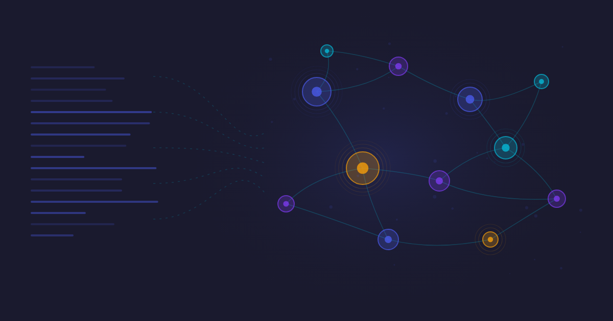

# Knowledge Graph Builder

Extract structured knowledge graphs from any text — documents, reports, articles, interview transcripts, or databases. Identifies entities, relationships, themes, quotes, and claims with confidence scoring. Outputs JSON ready for D3.js, Neo4j, or any graph database.

**Category:** Knowledge Management · **Created:** 2026-01-31

---

## How to Use — Just Ask

Say any of these to Claude and the skill activates:

> **"Extract a knowledge graph from..."**

> **"Build an entity relationship map from..."**

> **"Map out the relationships in..."**

> **"Create a knowledge graph from..."**

> **"Who and what is mentioned in this document?"**

### Worked Examples

**From interview transcripts:**
> "Extract a knowledge graph from this interview transcript"

Identifies every person, organisation, and concept mentioned. Maps who said what, who worked where, and which themes connect them. Outputs JSON with confidence scores on each relationship.

**Cross-referencing multiple sources:**
> "Build an entity relationship map from these three research articles"

Cross-references entities across all sources, identifies shared themes, and flags contradictions between articles with supporting quotes.

**Meeting notes and decisions:**
> "Create a knowledge graph from our project meeting notes for the last quarter"

Extracts decisions, action items, responsible people, and dependencies. Links them chronologically and validates timeline consistency.

**Fact-checking and evidence:**
> "Map out all the claims in this report and link them to their evidence"

Identifies every factual claim, assigns a confidence score based on supporting evidence, and flags unsupported assertions.

**Database preparation:**
> "Prepare this case study for import into Neo4j"

Outputs Cypher-compatible JSON with node labels, relationship types, and properties ready for direct graph database import.

**From unstructured notes:**
> "I've got a pile of research notes — help me see what connects to what"

Scans all notes, extracts entities and themes, and produces a relationship map showing clusters and connections you might have missed.

**Visualisation pipeline:**
> "Extract entities from this document and visualise them as a network graph"

Chains with the cool-charts skill — extracts the knowledge graph, then renders it as an interactive force-directed network.

---

## What You Get

A structured JSON knowledge graph containing:

- **Entities** — people, organisations, places, concepts, claims (with confidence scores)
- **Relationships** — typed connections between entities (with evidence links)
- **Quotes** — supporting passages linked to specific claims
- **Timeline** — chronological events with date validation
- **Themes** — high-level topic groupings

```json
{
  "entities": [
    { "id": "e1", "name": "Acme Corp", "type": "Organization", "confidence": 0.95 }
  ],
  "relationships": [
    { "source": "e1", "target": "e2", "type": "EMPLOYS", "confidence": 0.9 }
  ],
  "quotes": [
    { "text": "We restructured the entire division...", "speaker": "e2", "supports": ["r1"] }
  ]
}
```

## Installation

```bash
git clone https://github.com/context-is-everything/skills.git /tmp/cie-skills
cp -r /tmp/cie-skills/knowledge-graph-builder .claude/skills/
```

## Links

- [Community page](https://www.context-is-everything.com/community) · [Full skill documentation](SKILL.md)
